# Sexually Transmitted Infections - System Design Guide { #sti-agg-design }

## Introduction

The DHIS2 STI toolkit is based on the [WHO Framework for monitoring sexually transmitted infections and strengthening surveillance](https://iris.who.int/handle/10665/378238) and also draws on the [Consolidated guidelines on person-centred HIV strategic information: strengthening routine data for impact](https://www.who.int/publications/i/item/9789240055315).

This toolkit includes:

- WHO-recommended dashboard analyses for monitoring STI data using key metrics to adjust programming and drive impact
- Aggregate dataset and data elements to model aggregated tracker data for performant, anonymized analytics

The DHIS2 STI Toolkit aims to enhance data quality, improve monitoring, and facilitate timely response actions. It is designed to streamline routine data management, strengthen surveillance systems, and enable data-driven health policies.

The system design document explains the reference configuration in DHIS2 for the STI use case, including a detailed description of the dashboard, DHIS2 configuration and implementation. This document also does not consider the resources and infrastructure needed to implement such a system, such as servers, power, internet connections, backups, training and user support, which can be found in the [DHIS2 Implementation Guide](https://docs.dhis2.org/en/implement/implementing-dhis2/overview.html).

Reference metadata for this toolkit is available at: [dhis2.org/metadata-downloads](http://dhis2.org/metadata-downloads).

### Acknowledgement

The STI toolkit has been developed in partnership with WHO with support from France Ministry of Europe and Foreign Affairs. We are grateful to WHO for providing subject matter expertise in the design and development of these tools, as well as to the many countries who have shared their implementation experience with us.

## System design overview

### Background

Sexual health and well-being are important determinants of overall health.It is estimated that more than 1 million people 15–49 years old acquire one of four curable STIs each day (Treponemal pallidum (syphilis), Neisseria gonorrhoeae (gonorrhoea), Chlamydia trachomatis (chlamydia) and Trichomonas vaginalis (trichomoniasis). Other important infections that can be transmitted sexually include HIV, human papillomavirus (HPV), herpes simplex, hepatitis B and C, human T-lymphotropic virus type 1 and mpox.

Once infected with an STI, an individual may develop symptoms including vaginal or urethral discharge, pain with urination, genital or anal ulcers and genital warts. Left untreated, and irrespective of whether an individual develops symptoms, STIs can (depending on the infection) lead to long-term irreversible and potentially fatal outcomes including cancer, chronic pelvic pain, ectopic pregnancy, and infertility. Some STIs can also be transmitted from pregnant women to their infants, leading to adverse birth outcomes, including stillbirth, low birthweight, prematurity, neonatal death, or congenital abnormalities. There are also bidirectional interactions between STIs and HIV; people living with HIV may experience enhanced clinical manifestations of STIs, and some STIs facilitate the transmission and acquisition of HIV.

Individuals with an STI may be treated based on the symptoms they present (syndromic treatment) or may be identified by testing at a public, private or nongovernmental clinic. Individuals may also seek care from traditional health practitioners or self-treat with medicines bought from pharmacies, informal drug sellers or over the internet.

Regular collection of STI data from all service delivery and administrative levels is crucial for informing programme and policy decisions. This includes data on clinical cases reporting, infection prevalence and access to services. These data can be used to track the epidemiology of STIs and to monitor and improve prevention interventions. Collecting and interpreting these data can be challenging. STIs are often asymptomatic, and many individuals who are symptomatic seek care from a variety of public or private health-care providers or self-treat. In addition, the lack of low-cost rapid point-of-care diagnostic tests for most STIs means that individuals are often treated for multiple STIs based on their symptoms, not for the specific STI they have.

### Use case

The STI toolkit is designed to support the collection of routine data on STIs. This includes data on STI related syndromes, individuals with laboratory confirmed diagnoses of particular STIs, and indicators related to syphilis testing and treatment among pregnant women attending ANC care. The collection of these data should help inform the provision of STI related services.

### Intended users

The STI system design focuses on meeting the needs of end users at all levels of the health system, including those responsible for implementing STI programmes in countries. These users may include:

- **STI program managers & staff (national & sub-national)**: data users who are responsible for routine analysis of data, using data to improve operations and programme strategies, and providing data-driven feedback to programme staff, including implementing partners, facilities, and other service delivery points
- **STI programme data managers**: users who are responsible for overseeing data collection, management, data quality, analysis and reporting functions
- **System admins/HMIS focal points**: MOH staff and/or core DHIS2 team responsible for maintaining and improving data systems for health programmes, integrating data streams into national platforms, providing technical support for system design, adaptation and end user support; and maintaining the DHIS2 system over time
- **Implementing partners**: organizations who provide technical assistance to the Ministry of Health, collect and analyze data on behalf of the overall national programme strategy, and may be responsible for the operations of service delivery networks

### Design structure

The DHIS2 STI configuration is structured in two major components:

- **Dashboard and Indicators**: the STI dashboard and indicators are all served by the aggregate data model in DHIS2
- **Aggregate data sets**: aggregate datasets, data elements are configured according to the WHO’s STI analysis framework to populate the core indicators. One dataset is designed to receive aggregated tracker data and model this data in a performant way, leveraging the advantages of the aggregate data model in DHIS2 for analysis. Alternatively, this dataset can also be used for aggregate paper-based reporting; or to store data reported routinely from other individual-level data systems in use, such as sites using EMRs or other mobile applications.

These modular components are designed based on the heterogeneous nature of health information data systems in countries and support the typical architecture for implementing case-based data systems alongside integrated national HMIS infrastructure:

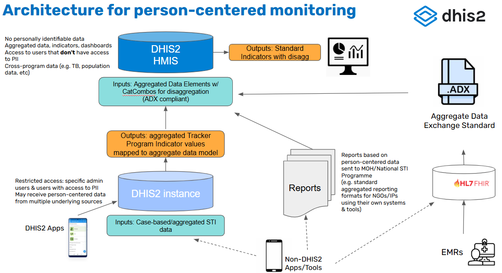

## Dashboard

Thematic dashboards for monitoring various aspects of STI programming have been developed based on the core indicators included in the [WHO Framework for monitoring sexually transmitted infections and strengthening surveillance](https://iris.who.int/handle/10665/378238) and the [WHO Consolidated guidelines on person-centred HIV strategic information: strengthening routine data for impact](https://www.who.int/publications/i/item/9789240055315).

Data on STIs and their syndromes provide information on the use of health care services for STIs and the infections and/or syndromes for which people are being treated. They also provide information on the burden of STIs and are markers of unprotected sex or sex without a condom. 

Two dashboards have been developed for STIs (1) health facility and (2) national and sub-national. Both dashboards are divided into four sections:

- STI syndromes
- STI diagnostic test confirmed cases of gonorrhoea and chlamydia
- STI diagnostic test confirmed cases of syphilis
- EMTCT for syphilis

> **Note:**
> Data in the dashboard are disaggregated by gender into three groups:  male, female, and not specified or other. Other includes trans and gender diverse people who choose an identity other than male or female.

### Health facility dashboard

#### STI syndrome

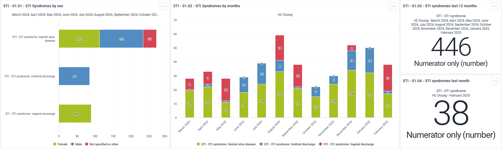

In many countries case management of STIs is based on the symptoms that an individual presents with. The dashboard is configured to display data for three STI- related syndromes: genital ulcer disease, urethral discharge syndrome, and vaginal discharge syndrome. Please note not all of these cases are related to an STI.

The first bar chart presents the total number of new cases diagnosed in the last 12 months by syndrome and gender, whilst the second shows the breakdown of new cases by month.

#### STI diagnostic test confirmed cases of Gonorrhoea and Chlamydia

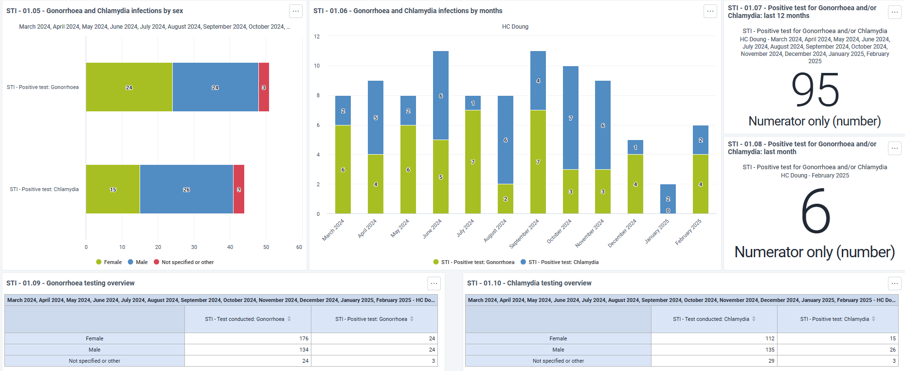

Access to diagnostic tests for gonorrhoea and chlamydia is limited, and, in most countries, the number of health facilities for which this section is relevant will be small. 

The first bar chart shows the number of individuals who tested positive in the preceding 12 months for gonorrhoea and chlamydia with a quality assured diagnostic test by gender, and the second the number who tested positive by month. The two tables provide data on the number of tests performed and the number of positive tests by gender.

#### STI diagnostic test confirmed cases of Syphilis

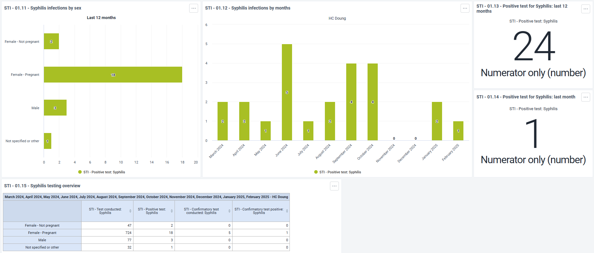

Diagnostic testing for syphilis is more widely available than for gonorrhoea and chlamydia, reflecting national and global recommendations for testing pregnant women and other populations for syphilis. The data for females are further broken down into pregnant and non-pregnant females.

There are a number of testing algorithms for syphilis involving different combinations of treponemal and non-treponemal tests. In this dashboard testing has been simplified based on the number of tests conducted (first test and confirmatory test).

The first bar chart shows the number of individuals who tested positive in the preceding 12 months by gender, and the second presents the number of individuals who tested positive by month. The table summarizes the number of syphilis tests performed, the number of confirmatory tests performed, and the number of positive tests.

#### EMTCT for Syphilis

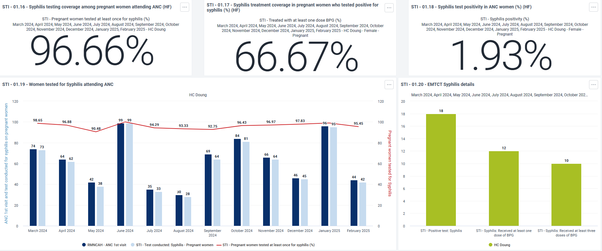

This dashboard documents health facility activities related to the elimination of mother to child transmission of syphilis. Testing pregnant women for syphilis is important for their own health and is the first step in preventing vertical transmission. WHO recommends that all pregnant women should be tested for syphilis at least once, and as early as possible, ideally at the first antenatal care visit. For women who test positive, the recommended treatment depends on the stage of infection (see Box A).

The first EMTCT bar chart shows the number of pregnant women attending ANC, the number tested at least once for syphilis, and the estimated testing coverage. The second chart records the number of women who tested positive (first test), the number who received at least one dose of BPG, and the number who received three doses.

> **[WHO Recommendations for treatment of syphilis in pregnant women (updated 2023)](https://www.who.int/publications/i/item/9789240090767)**
> In pregnant women with early syphilis, WHO recommends:
> 
> - benzathine penicillin G 2.4 million units once intramuscularly
>   
> If benzathine penicillin is not available, WHO suggests:
> 
> - procaine penicillin 1.2 million units intramuscularly once daily for 10 days
>   
> In rare situations when benzathine or procaine penicillin cannot be used (e.g. due to confirmed penicillin allergy, which occurs in less than 3% of the population, and where penicillin desensitization is not possible) or are not available (e.g. due to stock-outs), WHO suggests one of the following options with caution and enhanced follow-up:
> 
> - ceftriaxone 1 g intramuscularly once daily for 10–14 days; or
> - erythromycin 500 mg orally four times daily for 14 days.
>
> In pregnant women with *late syphilis or an unknown duration of infection*, WHO recommends:
> 
> - benzathine penicillin G 2.4 million units intramuscularly once weekly for three consecutive weeks
> 
> If benzathine penicillin is not available, WHO suggests:
> 
> - procaine penicillin 1.2 million units intramuscularly once daily for 20 days
> 
> In rare situations when benzathine or procaine penicillin cannot be used (e.g. due to confirmed penicillin allergy, which occurs in less than 3% of the population, and where penicillin desensitization is not possible) or are not available (e.g. due to stock-outs), WHO suggests using, with caution and enhanced follow-up:
> 
> - erythromycin 500 mg orally four times daily for 30 days.

### National and sub-national dashboard

This dashboard can be used either at national and subnational level as the visualisations are set-up to only show the information disaggregated by organisation unit level based on the level of access of the user

#### STI syndrome

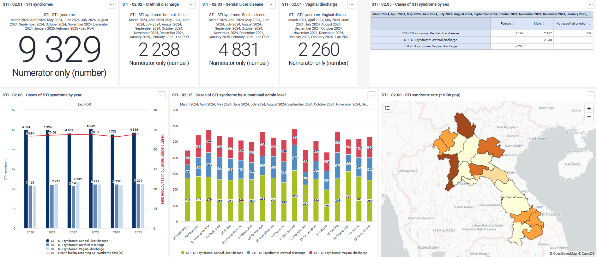

In many countries case management of STIs is based on the symptoms that an individual presents with. The dashboard is configured to display data for three STI-related syndromes: genital ulcer disease, urethral discharge syndrome, and vaginal discharge syndrome. Please note not all of these cases are related to a sexually transmitted infection.

The first bar chart shows the total number of new cases diagnosed over time by syndrome, and the percentage of health facilities reporting data on STIs. The second records the number of cases by region, and the map presents the number of reported cases per 1000 population. Data on gender disaggregation can be found in the table.

#### STI diagnostic test confirmed cases of Gonorrhoea and Chlamydia

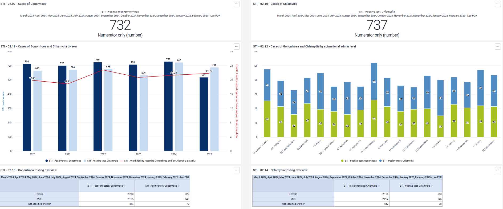

Access to diagnostic tests for gonorrhoea and chlamydia is limited, and, in most countries, the number of health facilities for which this section is relevant will be limited. 

The first bar chart records the number of individuals who tested positive for gonorrhoea and chlamydia over time, and the percentage of health facilities reporting data on gonorrhoea or chlamydia testing. The second shows the number of cases by region. Data on the number of tests performed and the number of positive tests by gender are presented in the two tables.

#### STI diagnostic test confirmed cases of Syphilis

Diagnostic testing for syphilis is more widely available than for gonorrhoea and chlamydia, reflecting national and global recommendations for testing pregnant women and other populations for syphilis. The data for females are further broken down further into pregnant and non-pregnant females.

There are a number of testing algorithms for syphilis involving different combinations of treponemal and non-treponemal tests. In this dashboard testing has been simplified based on the number of tests conducted (first test and confirmatory test). 

The first bar chart shows the number of individuals who tested positive by year, and the percentage of health facilities reporting data on syphilis testing. The second records the number of individuals testing positive by region. The table summarizes the number of tests performed, the number of confirmatory tests performed, and the number positive on each by gender, and subdivides women by pregnancy status.

#### EMTCT for Syphilis

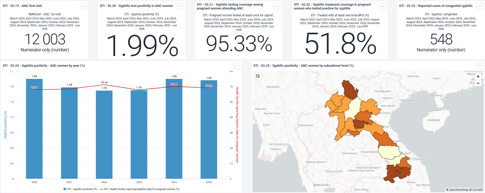

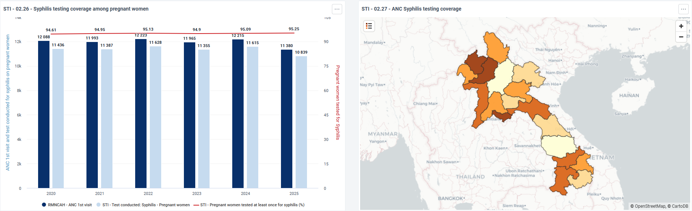

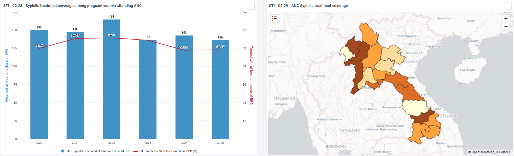

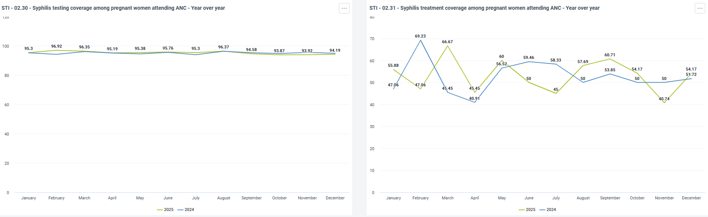

The global community has committed itself to the elimination of mother-to-child transmission (EMTCT) of HIV, syphilis and hepatitis B virus (HBV) as a public health priority. The Triple EMTCT initiative focuses on a harmonized approach to improving health outcomes for mothers and children. Box B summarizes the impact and process criteria for validation of EMTCT of syphilis. 

This dashboard documents health facility activities related to the elimination of mother to child transmission of syphilis. WHO recommends that all pregnant women should be tested for syphilis at least once, and as early as possible, ideally at the first antenatal care visit. For women who test positive, the recommended treatment depends on the stage of infection (see Box A).

There are four sets of figures:

- Syphilis test positivity in pregnant women: the bar chart shows the percentage of pregnant women who tested positive for syphilis (first test) and the percentage of ANC facilities reporting data on syphilis test positivity in pregnant women. The map presents test positivity (%) by region.
- Syphilis testing coverage in pregnant women attending ANC: the bar chart shows the number of women who attended ANC at least once, the number of first syphilis tests conducted, and the estimated testing coverage (%). The map presents testing coverage (%) by region. 
- Syphilis treatment coverage in pregnant women who test positive: the bar chart shows the number of women who tested positive for syphilis on their first test, the number of women who received at least one dose of BPG and the estimated testing coverage (%). The map presents treatment coverage (%) by region.
- Testing and treatment coverage over time: these figures show for the last two years a month-by-month comparison of (a) testing coverage (%) and (b) treatment coverage (%)

> **Summary of required impact and process targets for global validation of EMTCT of syphilis**
> Impact target:
> 
> - a case rate of congenital syphilis of ≤50 per 100 000 live births
>   
> Process Targets:
> 
> - ≥95% ANC coverage (at least one visit) (ANC-1)
> - ≥95% coverage of syphilis testing of pregnant women in ANC
> - ≥95% adequate treatment of syphilis-seropositive pregnant women
>
>   The impact target is based on the surveillance case definition of congenital syphilis. WHO has developed two options depending on the clinical context: [1] a live birth or fetal death at >20 weeks of gestation or >500 g (including stillbirth) born to a woman with positive syphilis serology and without adequate syphilis treatment  OR [2] a live birth, stillbirth or child < 2 years of age born to a women with positive syphilis serology or with unknown serostatus and with laboratory and/or radiographic and/or clinical evidence of syphilis infection (regardless of the timing or adequacy of maternal treatment).
>   
>   A woman with a history of past syphilis diagnosis and for whom previous syphilis treatment can be confirmed should be evaluated for risk of reinfection but does not automatically require re-treatment. However, women living in high-prevalence settings (>1%) or whose own or partner’s behaviours places them at risk, or whose partners were not treated for syphilis, may warrant evaluation for reinfection later in pregnancy and in subsequent pregnancies
>
> Source: [Global guidance on criteria and processes for validation- elimination of mother-to-child transmission of HIV, syphilis and hepatitis B virus](https://www.who.int/publications/i/item/9789240039360)

## Data Sets

As described above, dashboards are populated using the aggregate data model, using DHIS2 indicators. Aggregate dataset, data elements and category combinations have been configured to serve the analytics based on the dimensions of analysis included in the strategic information and data use guidelines.

This dataset can be used for aggregated reporting among sites that do not yet have Tracker; or sites that submit routine reports that aggregate data from another individual level data collection tool.
There is one dataset for capturing STI data. This has been designed based on the analytical needs represented in the WHO’s analysis framework

### STI

This dataset contains the main source of information for the analysis of STI programs at Health Facility and national/subnational level:

- STI - STI syndrome: Urethral discharge
- STI - STI syndrome: Vaginal discharge
- STI - STI syndrome: Genital ulcer disease
- STI - Test conducted: Gonorrhoea
- STI - Test conducted: Chlamydia
- STI - Test conducted: Syphilis
- STI - Positive test: Syphilis
- STI - Positive test: Gonorrhoea
- STI - Positive test: Chlamydia
- STI - Confirmatory test conducted: Syphilis
- STI - Confirmatory test positive: Syphilis
- STI - Syphilis: Received at least one dose of BPG
- STI - Syphilis: Received at least three doses of BPG
- STI - Syphilis: congenital

## Analytics

As mentioned in the dashboard section, a group of visualizations use indicators calculating the reporting rate for specific elements:

- STI - Health facility reporting STI syndrome data (%)
- STI - Health facility reporting Gonorrhoea and/or Chlamydia data (%)
- STI - Health facility reporting Syphilis data (%)
- STI - Health facility reporting Syphilis data for pregnant women (%)

Those indicators are composed by:

- Numerator: Data element populated by a predictor assigning a value (1) if any data has been reported (including 0)
- Denominator: all the Health facility

>**Note:**
>Only the Health Facility providing the service should be included in the denominator

## User group

Three standard group are included in the downloadable .json

| User group         | Metadata          | Data              |
|--------------------|-------------------|-------------------|
| STI - Admin        | Can edit and view | No access         |
| STI - Access       | Can view only     | Can view only     |
| STI - Data Capture | Can view only     | Can edit and view |

